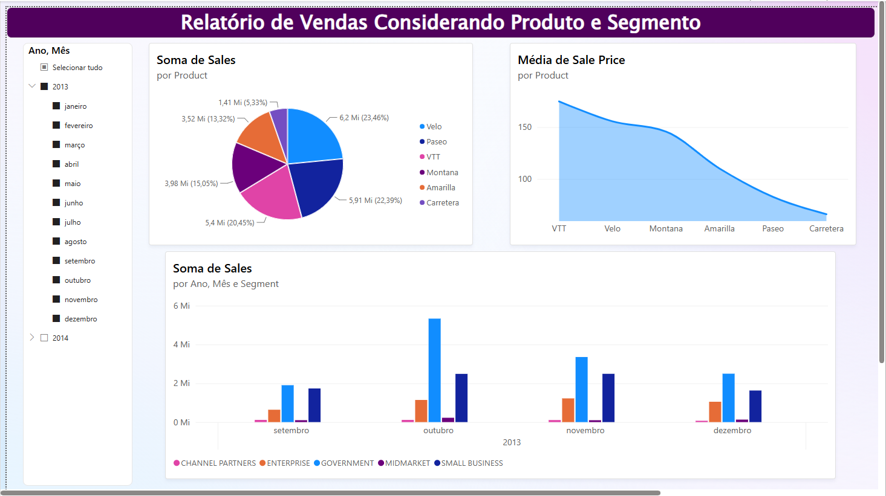
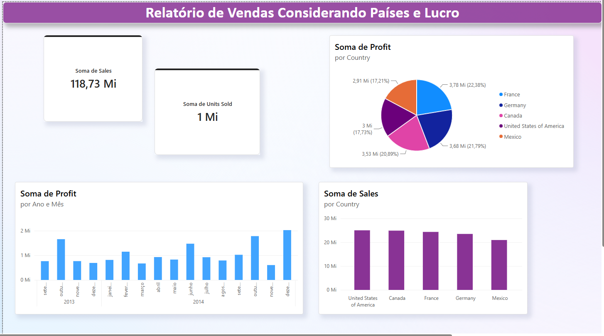
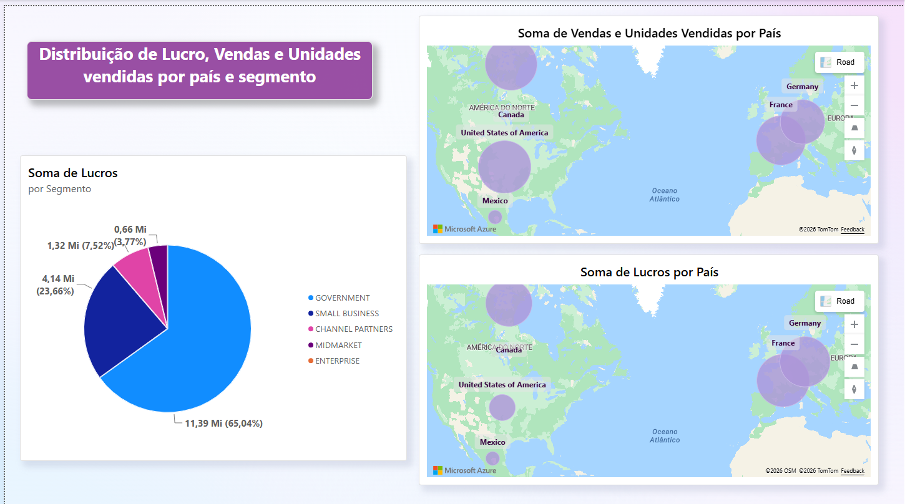

# Estudo Sample Financials do Power BI

Este repositório contém um projeto de análise de dados interativo desenvolvido no **Power BI Desktop**, utilizando a base de dados nativa de exemplo do Power BI, a **Financial Samples**.

O objetivo do projeto é explorar técnicas de modelagem, transformação e visualização de dados no Power BI para extrair insights valiosos sobre desempenho financeiro, volume de vendas, lucratividade por região, segmentos de mercado e categorias de produtos.

---

## Sobre a Base de Dados

A base **Financial Samples** é um conjunto de dados fictício que simula as operações comerciais e financeiras globais de uma empresa. Ela contém registros detalhados cobrindo diferentes regiões geográficas, segmentos de mercado (*Government*, *Small Business*, *Enterprise*, *Midmarket* e *Channel Partners*) e uma linha de produtos diversificada.

A base disponibiliza métricas essenciais como:

* **Units Sold:** Quantidade de unidades vendidas.
* **Manufacturing Price & Sale Price:** Preço de custo/fabricação e preço de venda unitário.
* **Gross Sales & Discounts:** Faturamento bruto e descontos aplicados.
* **Sales & COGS:** Faturamento líquido total e Custo dos Bens Vendidos (*Cost of Goods Sold*).
* **Profit:** Lucro líquido obtido por transação.
* **Date, Month & Year:** Marcações temporais cobrindo o período de 2013 a 2014 para análise de inteligência de tempo.

---

## Relatórios do Dashboard

Todos os painéis desenvolvidos neste relatório são **totalmente interativos**, permitindo o cruzamento de informações por meio do clique nos elementos visuais e da utilização da segmentação de dados.

### 1. Relatório de Vendas Considerando Produto e Segmento

#### Descrição e Insights:

Neste relatório, o objetivo principal foi visualizar a quantidade e o volume de vendas por produto, analisar o preço médio praticado e entender o comportamento das vendas ao longo do tempo por segmento de cliente:

* **Distribuição de Vendas por Produto:** Através do gráfico de pizza, observa-se a participação das vendas entre os produtos da empresa (`Velo` liderando com 23,46%, seguido por `Paseo` com 22,39%, `VTT`, `Montana`, `Amarilla` e `Carretera`).
* **Média de Sale Price por Produto:** O gráfico de área destaca a variação do preço médio cobrado por cada item, mostrando que o produto `VTT` apresenta o maior preço médio de venda (acima de 150), enquanto o `Carretera` possui o menor valor médio.
* **Soma de Vendas por Ano, Mês e Segmento:** O gráfico de colunas agrupadas analisa a evolução das vendas mês a mês (com grande concentração no segundo semestre de 2013), destacando os segmentos `Government` e `Small Business` como os maiores geradores de receita.
* **Segmentação de Dados (Slicer):** Filtro temporal intuitivo na lateral esquerda que permite navegar facilmente por anos (2013 e 2014) e meses específicos.

---

### 2. Relatório de Vendas Considerando Países e Lucro

#### Descrição e Insights:

Este painel foca na distribuição geográfica dos resultados financeiros, no acompanhamento temporal do lucro e na exibição dos principais indicadores globais de desempenho (KPIs):

* **Cartões de Indicadores (KPIs):** Destaque no topo para o **Total de Vendas (118,73 Mi em Sales)** e o **Total de Unidades Vendidas (1 Mi em Units Sold)**.
* **Divisão de Lucro por País:** O gráfico de pizza detalha a porcentagem do lucro líquido gerado por cada país, mostrando um equilíbrio competitivo onde a **França (22,38% / 3,78 Mi)** e a **Alemanha (21,79% / 3,68 Mi)** lideram a margem, seguidos por Canadá, EUA e México.
* **Evolução Temporal do Lucro:** Um gráfico de colunas exibe a soma de *Profit* mês a mês ao longo de 2013 e 2014, evidenciando picos de lucratividade nos meses de dezembro.
* **Soma de Vendas por País:** O gráfico de colunas na parte inferior compara o faturamento bruto dos 5 países (*United States of America*, *Canada*, *France*, *Germany* e *Mexico*), onde os EUA lideram em volume total de vendas (aproximadamente 25 Mi).

---

### 3. Distribuição de Lucro, Vendas e Unidades Vendidas

#### 📝 Descrição e Insights:

Um painel analítico avançado focado em geolocalização e na comparação direta entre o volume de vendas e o lucro líquido real obtido:

* **Análise Comparativa Geoespacial (Azure Maps):**
  * **Mapa de Vendas e Unidades:** O mapa superior exibe a soma de vendas por país através de marcadores proporcionais, permitindo também visualizar o total de *Units Sold* ao passar o mouse (*Tooltip*) sobre os pontos.
  * **Mapa de Lucros:** O mapa inferior foca exclusivamente na distribuição do *Profit* por país.
  * **Insight Principal de Margem:** A comparação entre os dois mapas demonstra visualmente que ter o maior volume de vendas (como nos EUA) não garante necessariamente a maior margem de lucro líquido proporcional.
* **Soma de Lucros por Segmento:** O gráfico de pizza lateral traz um detalhamento crucial sobre a origem do lucro por canal de vendas, evidenciando que o segmento **Government** é o grande motor de rentabilidade do negócio, representando **65,04% (11,39 Mi)** de todo o lucro gerado, seguido por *Small Business* (23,66%).

---

## Tecnologias e Recursos Utilizados

* **Power BI Desktop:** Construção do modelo, visuais e layouts do dashboard.
* **Power Query:** Tratamento, limpeza e organização dos dados da base *Financial Samples*.
* **DAX (Data Analysis Expressions):** Criação de agregações como `Soma de Sales`, `Soma de Profit`, `Média de Sale Price` e `Soma de Units Sold`.
* **Visual do Azure Maps:** Mapeamento geoespacial e análise visual comparativa por localização.

---

## Como Visualizar este Projeto

1. Faça o download ou clone este repositório para o seu computador.
2. Certifique-se de ter o **Power BI Desktop** instalado caso deseje abrir o arquivo `.pbix` do projeto.
3. Se quiser conferir a versão estática em alta resolução, **clique no arquivo EstudoVendasSampleFinancials.pdf** para visualizar o arquivo `.pdf`.
